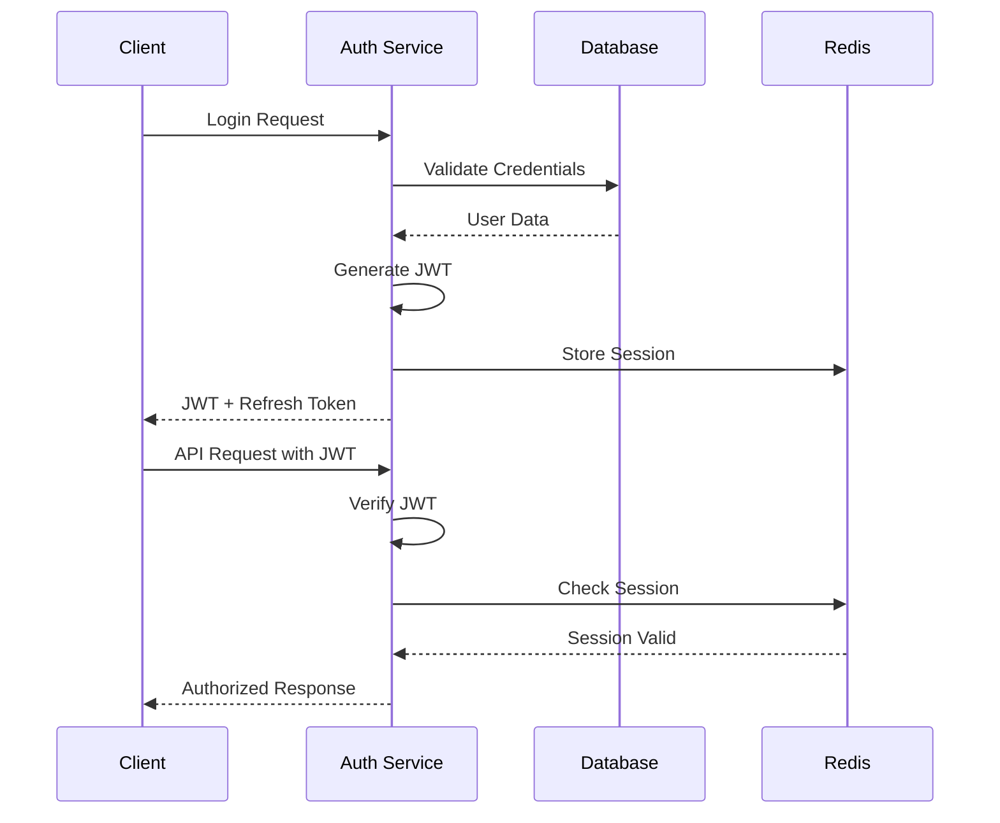

# Design Document - Supabase to Custom Backend Migration

## Overview

This design document outlines the architecture and implementation strategy for migrating the EvolveSync project management application from Supabase to a custom Node.js/Express backend with PostgreSQL (Neon), Prisma ORM, and Redis caching. The migration will maintain all existing functionality while providing better control, performance, and security.

## Architecture

### High-Level Architecture

```mermaid
graph TB
    subgraph "Frontend (React/TypeScript)"
        A[React Components]
        B[AuthContext]
        C[API Client]
        D[Route Guards]
    end
    
    subgraph "Backend (Node.js/Express)"
        E[Express Server]
        F[Authentication Middleware]
        G[API Routes]
        H[Business Logic]
        I[Data Access Layer]
    end
    
    subgraph "Data Layer"
        J[PostgreSQL (Neon)]
        K[Redis Cache]
        L[File Storage]
    end
    
    A --> C
    B --> C
    C --> E
    E --> F
    F --> G
    G --> H
    H --> I
    I --> J
    I --> K
    H --> L
```

### Technology Stack

#### Backend
- **Runtime**: Node.js 18+
- **Framework**: Express.js with TypeScript
- **Database**: PostgreSQL (Neon) with Prisma ORM
- **Caching**: Redis for sessions and data caching
- **Authentication**: JWT tokens with bcrypt password hashing
- **File Storage**: Local storage with future cloud migration support
- **Validation**: Zod for request/response validation
- **Testing**: Jest with Supertest for API testing

#### Frontend
- **Framework**: React 18+ with TypeScript
- **Build Tool**: Vite
- **Styling**: TailwindCSS with shadcn/ui
- **State Management**: React Context API
- **HTTP Client**: Axios with interceptors
- **Routing**: React Router with protected routes

## Components and Interfaces

### Backend Architecture

#### 1. Project Structure
```
backend/
├── src/
│   ├── config/
│   │   ├── database.ts
│   │   ├── redis.ts
│   │   └── environment.ts
│   ├── controllers/
│   │   ├── auth.controller.ts
│   │   ├── user.controller.ts
│   │   ├── department.controller.ts
│   │   ├── project.controller.ts
│   │   ├── task.controller.ts
│   │   ├── timeEntry.controller.ts
│   │   ├── attendance.controller.ts
│   │   ├── leave.controller.ts
│   │   └── expense.controller.ts
│   ├── middleware/
│   │   ├── auth.middleware.ts
│   │   ├── validation.middleware.ts
│   │   ├── rbac.middleware.ts
│   │   └── rateLimit.middleware.ts
│   ├── models/
│   │   └── (Prisma generated models)
│   ├── routes/
│   │   ├── auth.routes.ts
│   │   ├── user.routes.ts
│   │   ├── department.routes.ts
│   │   ├── project.routes.ts
│   │   ├── task.routes.ts
│   │   ├── timeEntry.routes.ts
│   │   ├── attendance.routes.ts
│   │   ├── leave.routes.ts
│   │   └── expense.routes.ts
│   ├── services/
│   │   ├── auth.service.ts
│   │   ├── user.service.ts
│   │   ├── email.service.ts
│   │   ├── cache.service.ts
│   │   └── file.service.ts
│   ├── utils/
│   │   ├── jwt.util.ts
│   │   ├── password.util.ts
│   │   ├── validation.util.ts
│   │   └── response.util.ts
│   ├── types/
│   │   ├── auth.types.ts
│   │   ├── api.types.ts
│   │   └── database.types.ts
│   └── app.ts
├── prisma/
│   ├── schema.prisma
│   ├── migrations/
│   └── seed.ts
├── tests/
├── docker-compose.yml
├── Dockerfile
└── package.json
```

#### 2. Database Schema (Prisma)

```prisma
// prisma/schema.prisma
generator client {
  provider = "prisma-client-js"
}

datasource db {
  provider = "postgresql"
  url      = env("DATABASE_URL")
}

enum UserRole {
  SUPER_ADMIN
  ORG_ADMIN
  DEPT_ADMIN
  PROJECT_MANAGER
  TEAM_LEAD
  EMPLOYEE
  CONTRACTOR
}

enum ProjectStatus {
  PLANNING
  ACTIVE
  ON_HOLD
  COMPLETED
  CANCELLED
}

enum TaskStatus {
  TODO
  IN_PROGRESS
  REVIEW
  DONE
  BLOCKED
}

enum PriorityLevel {
  LOW
  MEDIUM
  HIGH
  URGENT
}

enum AttendanceStatus {
  PRESENT
  ABSENT
  LATE
  HALF_DAY
  WORK_FROM_HOME
}

enum LeaveType {
  ANNUAL
  SICK
  MATERNITY
  PATERNITY
  BEREAVEMENT
  STUDY
  UNPAID
}

enum ApprovalStatus {
  PENDING
  APPROVED
  REJECTED
  CANCELLED
}

enum ExpenseCategory {
  TRAVEL
  MEALS
  ACCOMMODATION
  OFFICE_SUPPLIES
  CLIENT_ENTERTAINMENT
  OTHER
}

enum ExpenseStatus {
  DRAFT
  SUBMITTED
  APPROVED
  REJECTED
  REIMBURSED
}

model User {
  id          String   @id @default(uuid())
  email       String   @unique
  password    String
  fullName    String?  @map("full_name")
  avatarUrl   String?  @map("avatar_url")
  role        UserRole @default(EMPLOYEE)
  departmentId String? @map("department_id")
  phone       String?
  position    String?
  hireDate    DateTime? @map("hire_date")
  employeeId  String?  @unique @map("employee_id")
  isActive    Boolean  @default(true) @map("is_active")
  createdAt   DateTime @default(now()) @map("created_at")
  updatedAt   DateTime @updatedAt @map("updated_at")

  // Relations
  department      Department?    @relation(fields: [departmentId], references: [id])
  managedProjects Project[]      @relation("ProjectManager")
  assignedTasks   Task[]         @relation("TaskAssignee")
  reportedTasks   Task[]         @relation("TaskReporter")
  timeEntries     TimeEntry[]
  attendance      Attendance[]
  leaveRequests   LeaveRequest[]
  expenses        Expense[]
  approvedLeaves  LeaveRequest[] @relation("LeaveApprover")
  approvedExpenses Expense[]     @relation("ExpenseApprover")

  @@map("users")
}

model Department {
  id          String   @id @default(uuid())
  name        String
  description String?
  managerId   String?  @map("manager_id")
  isActive    Boolean  @default(true) @map("is_active")
  createdAt   DateTime @default(now()) @map("created_at")
  updatedAt   DateTime @updatedAt @map("updated_at")

  // Relations
  users    User[]
  projects Project[]

  @@map("departments")
}

model Project {
  id            String        @id @default(uuid())
  name          String
  description   String?
  status        ProjectStatus @default(PLANNING)
  priority      PriorityLevel @default(MEDIUM)
  startDate     DateTime?     @map("start_date")
  endDate       DateTime?     @map("end_date")
  budget        Decimal?      @db.Decimal(12, 2)
  departmentId  String        @map("department_id")
  managerId     String        @map("manager_id")
  githubRepoUrl String?       @map("github_repo_url")
  createdAt     DateTime      @default(now()) @map("created_at")
  updatedAt     DateTime      @updatedAt @map("updated_at")

  // Relations
  department  Department  @relation(fields: [departmentId], references: [id])
  manager     User        @relation("ProjectManager", fields: [managerId], references: [id])
  tasks       Task[]
  timeEntries TimeEntry[]
  expenses    Expense[]

  @@map("projects")
}

model Task {
  id                 String        @id @default(uuid())
  title              String
  description        String?
  status             TaskStatus    @default(TODO)
  priority           PriorityLevel @default(MEDIUM)
  projectId          String        @map("project_id")
  assigneeId         String?       @map("assignee_id")
  reporterId         String        @map("reporter_id")
  parentTaskId       String?       @map("parent_task_id")
  estimatedHours     Decimal?      @map("estimated_hours") @db.Decimal(5, 2)
  actualHours        Decimal?      @map("actual_hours") @db.Decimal(5, 2)
  dueDate            DateTime?     @map("due_date")
  githubIssueNumber  Int?          @map("github_issue_number")
  githubPrNumber     Int?          @map("github_pr_number")
  createdAt          DateTime      @default(now()) @map("created_at")
  updatedAt          DateTime      @updatedAt @map("updated_at")

  // Relations
  project     Project     @relation(fields: [projectId], references: [id])
  assignee    User?       @relation("TaskAssignee", fields: [assigneeId], references: [id])
  reporter    User        @relation("TaskReporter", fields: [reporterId], references: [id])
  parentTask  Task?       @relation("TaskHierarchy", fields: [parentTaskId], references: [id])
  subTasks    Task[]      @relation("TaskHierarchy")
  timeEntries TimeEntry[]

  @@map("tasks")
}

model TimeEntry {
  id              String    @id @default(uuid())
  userId          String    @map("user_id")
  taskId          String?   @map("task_id")
  projectId       String?   @map("project_id")
  description     String?
  startTime       DateTime  @map("start_time")
  endTime         DateTime? @map("end_time")
  durationMinutes Int?      @map("duration_minutes")
  isBillable      Boolean   @default(false) @map("is_billable")
  createdAt       DateTime  @default(now()) @map("created_at")
  updatedAt       DateTime  @updatedAt @map("updated_at")

  // Relations
  user    User     @relation(fields: [userId], references: [id])
  task    Task?    @relation(fields: [taskId], references: [id])
  project Project? @relation(fields: [projectId], references: [id])

  @@map("time_entries")
}

model Attendance {
  id                   String           @id @default(uuid())
  userId               String           @map("user_id")
  date                 DateTime         @db.Date
  clockIn              DateTime?        @map("clock_in")
  clockOut             DateTime?        @map("clock_out")
  breakDurationMinutes Int              @default(0) @map("break_duration_minutes")
  totalHours           Decimal?         @map("total_hours") @db.Decimal(4, 2)
  status               AttendanceStatus @default(PRESENT)
  location             String?
  notes                String?
  createdAt            DateTime         @default(now()) @map("created_at")
  updatedAt            DateTime         @updatedAt @map("updated_at")

  // Relations
  user User @relation(fields: [userId], references: [id])

  @@unique([userId, date])
  @@map("attendance")
}

model LeaveRequest {
  id               String         @id @default(uuid())
  userId           String         @map("user_id")
  leaveType        LeaveType      @map("leave_type")
  startDate        DateTime       @map("start_date") @db.Date
  endDate          DateTime       @map("end_date") @db.Date
  daysRequested    Int            @map("days_requested")
  reason           String?
  status           ApprovalStatus @default(PENDING)
  approvedBy       String?        @map("approved_by")
  approvedAt       DateTime?      @map("approved_at")
  rejectionReason  String?        @map("rejection_reason")
  createdAt        DateTime       @default(now()) @map("created_at")
  updatedAt        DateTime       @updatedAt @map("updated_at")

  // Relations
  user     User  @relation(fields: [userId], references: [id])
  approver User? @relation("LeaveApprover", fields: [approvedBy], references: [id])

  @@map("leave_requests")
}

model Expense {
  id              String          @id @default(uuid())
  userId          String          @map("user_id")
  category        ExpenseCategory
  amount          Decimal         @db.Decimal(10, 2)
  currency        String          @default("USD")
  description     String
  expenseDate     DateTime        @map("expense_date") @db.Date
  receiptUrl      String?         @map("receipt_url")
  status          ExpenseStatus   @default(DRAFT)
  approvedBy      String?         @map("approved_by")
  approvedAt      DateTime?       @map("approved_at")
  rejectionReason String?         @map("rejection_reason")
  projectId       String?         @map("project_id")
  createdAt       DateTime        @default(now()) @map("created_at")
  updatedAt       DateTime        @updatedAt @map("updated_at")

  // Relations
  user     User     @relation(fields: [userId], references: [id])
  approver User?    @relation("ExpenseApprover", fields: [approvedBy], references: [id])
  project  Project? @relation(fields: [projectId], references: [id])

  @@map("expenses")
}
```

#### 3. Authentication System

```typescript
// src/services/auth.service.ts
export class AuthService {
  async register(userData: RegisterData): Promise<AuthResponse>
  async login(email: string, password: string): Promise<AuthResponse>
  async logout(userId: string): Promise<void>
  async refreshToken(refreshToken: string): Promise<AuthResponse>
  async resetPassword(email: string): Promise<void>
  async changePassword(userId: string, oldPassword: string, newPassword: string): Promise<void>
  async verifyToken(token: string): Promise<User>
}

// src/middleware/auth.middleware.ts
export const authenticateToken = (req: Request, res: Response, next: NextFunction)
export const requireRole = (roles: UserRole[]) => (req: Request, res: Response, next: NextFunction)
```

#### 4. API Endpoints Structure

```typescript
// Authentication Routes
POST   /api/auth/register
POST   /api/auth/login
POST   /api/auth/logout
POST   /api/auth/refresh
POST   /api/auth/forgot-password
POST   /api/auth/reset-password
POST   /api/auth/change-password

// User Management Routes
GET    /api/users
GET    /api/users/:id
PUT    /api/users/:id
DELETE /api/users/:id
POST   /api/users/:id/promote-super-admin

// Department Routes
GET    /api/departments
POST   /api/departments
GET    /api/departments/:id
PUT    /api/departments/:id
DELETE /api/departments/:id

// Project Routes
GET    /api/projects
POST   /api/projects
GET    /api/projects/:id
PUT    /api/projects/:id
DELETE /api/projects/:id

// Task Routes
GET    /api/tasks
POST   /api/tasks
GET    /api/tasks/:id
PUT    /api/tasks/:id
DELETE /api/tasks/:id

// Time Entry Routes
GET    /api/time-entries
POST   /api/time-entries
GET    /api/time-entries/:id
PUT    /api/time-entries/:id
DELETE /api/time-entries/:id
POST   /api/time-entries/start-timer
POST   /api/time-entries/stop-timer

// Attendance Routes
GET    /api/attendance
POST   /api/attendance/clock-in
POST   /api/attendance/clock-out
GET    /api/attendance/:userId/:date
PUT    /api/attendance/:id

// Leave Request Routes
GET    /api/leave-requests
POST   /api/leave-requests
GET    /api/leave-requests/:id
PUT    /api/leave-requests/:id
POST   /api/leave-requests/:id/approve
POST   /api/leave-requests/:id/reject

// Expense Routes
GET    /api/expenses
POST   /api/expenses
GET    /api/expenses/:id
PUT    /api/expenses/:id
DELETE /api/expenses/:id
POST   /api/expenses/:id/approve
POST   /api/expenses/:id/reject
POST   /api/expenses/upload-receipt
```

### Frontend Architecture

#### 1. Updated AuthContext

```typescript
// src/contexts/AuthContext.tsx
interface AuthContextType {
  user: User | null
  loading: boolean
  login: (email: string, password: string) => Promise<void>
  register: (userData: RegisterData) => Promise<void>
  logout: () => Promise<void>
  updateProfile: (updates: Partial<User>) => Promise<void>
  promoteToSuperAdmin: (email: string) => Promise<void>
}

export const AuthProvider: React.FC<{ children: React.ReactNode }> = ({ children }) => {
  // Implementation with custom API calls instead of Supabase
}
```

#### 2. API Client

```typescript
// src/lib/api.ts
class ApiClient {
  private baseURL: string
  private token: string | null = null

  constructor(baseURL: string) {
    this.baseURL = baseURL
    this.setupInterceptors()
  }

  private setupInterceptors() {
    // Request interceptor to add auth token
    // Response interceptor to handle token refresh
  }

  async get<T>(endpoint: string): Promise<T>
  async post<T>(endpoint: string, data: any): Promise<T>
  async put<T>(endpoint: string, data: any): Promise<T>
  async delete<T>(endpoint: string): Promise<T>
}

export const apiClient = new ApiClient(process.env.REACT_APP_API_URL!)
```

## Data Models

### User Authentication Flow



### Database Migration Strategy

1. **Schema Conversion**: Convert Supabase schema to Prisma schema
2. **Data Export**: Export existing data from Supabase
3. **Data Transformation**: Transform data to match new schema
4. **Data Import**: Import data into new PostgreSQL database
5. **Validation**: Verify data integrity and relationships

## Error Handling

### API Error Response Format

```typescript
interface ApiError {
  success: false
  error: {
    code: string
    message: string
    details?: any
  }
  timestamp: string
  path: string
}

interface ApiSuccess<T> {
  success: true
  data: T
  message?: string
  timestamp: string
}
```

### Error Categories

1. **Authentication Errors**: Invalid credentials, expired tokens
2. **Authorization Errors**: Insufficient permissions
3. **Validation Errors**: Invalid input data
4. **Database Errors**: Connection issues, constraint violations
5. **Server Errors**: Internal server errors, service unavailable

## Testing Strategy

### Backend Testing

1. **Unit Tests**: Test individual functions and services
2. **Integration Tests**: Test API endpoints with database
3. **Authentication Tests**: Test JWT generation and validation
4. **Authorization Tests**: Test role-based access control
5. **Database Tests**: Test Prisma models and queries

### Frontend Testing

1. **Component Tests**: Test React components with new API integration
2. **Context Tests**: Test AuthContext with custom authentication
3. **Integration Tests**: Test complete user flows
4. **API Tests**: Test API client functionality

## Security Considerations

### Authentication Security

1. **JWT Security**: Secure token generation with proper expiration
2. **Password Security**: bcrypt hashing with salt rounds
3. **Session Management**: Redis-based session storage with TTL
4. **Rate Limiting**: Prevent brute force attacks
5. **CORS Configuration**: Proper cross-origin resource sharing

### Data Security

1. **Input Validation**: Zod schema validation for all inputs
2. **SQL Injection Prevention**: Prisma ORM parameterized queries
3. **XSS Prevention**: Proper data sanitization
4. **File Upload Security**: File type validation and virus scanning
5. **Environment Variables**: Secure configuration management

## Performance Optimization

### Caching Strategy

1. **Redis Caching**: Cache frequently accessed data
2. **Query Optimization**: Efficient database queries with Prisma
3. **Connection Pooling**: PostgreSQL connection pooling
4. **Response Compression**: Gzip compression for API responses
5. **Static Asset Caching**: Proper cache headers for static files

### Database Optimization

1. **Indexing**: Strategic database indexing for performance
2. **Query Optimization**: Efficient Prisma queries with includes
3. **Connection Management**: Proper database connection handling
4. **Migration Performance**: Efficient database migrations

## Deployment Strategy

### Development Environment

1. **Docker Compose**: Local development with PostgreSQL and Redis
2. **Environment Variables**: Proper configuration management
3. **Hot Reloading**: Development server with auto-restart
4. **Database Seeding**: Sample data for development

### Production Deployment

1. **Containerization**: Docker containers for backend services
2. **Database**: Neon PostgreSQL with connection pooling
3. **Caching**: Redis Cloud or self-hosted Redis
4. **Monitoring**: Application performance monitoring
5. **Logging**: Structured logging with log aggregation

This design provides a comprehensive foundation for migrating from Supabase to a custom backend while maintaining all existing functionality and improving performance, security, and maintainability.